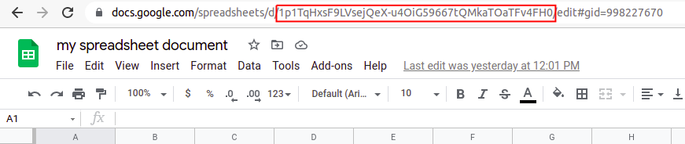
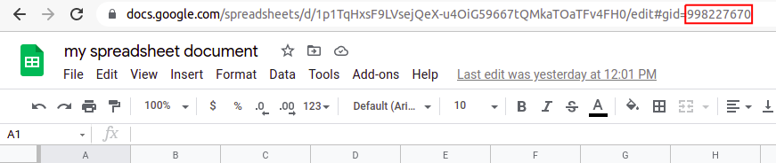

# Description

Reads the first or specified sheet of a Google spreadsheet document and returns the content as an array of objects or readable stream.

# API

The package represents a function with the following signature:
```
readSpreadsheet(spreadsheetId[, options]);
```
where:
- `spreadsheetId` is the ID of a **public** Google spreadsheet document. You can get it from here:



- `options` is an object which can contain:
  - `throwable` (boolean) - defines if it's needed to throw an exception or just return an empty result if some operation can't be completed; default: `false`;
  - `isCsv` (boolean) - defines if content must be returned as CSV (if `true`) or JSON (if `false`); default: `false`;
  - `isStream` (boolean) - defines if content is represented as a readable stream with processed data (if `true`) or just stringified data (if `false`); default: `false`;
  - `directStream` (boolean) - defines if you need to receive a direct stream of reading spreadsheet document without any modifications as it is; ignores `isCsv` and `isStream` options; default: `false`;
  - `eolType` (string) - sets symbols for the end of line for CSV content if `isCsv = true` and `directStream = false`; default value is that which is relevant for OS where the package is being used;
  - `gid` (string) - sets an ID of a sheet from a spreadsheet document; the 1st sheet is read if not set; default: `null`. You can get it from here:



# Usage

1. Init a new project:
   ```bash
   npm init -y
   ```

2. Install the package:
   ```bash
   npm i read-spreadsheet
   ```

3. Create `index.js` file with the following content: 
   ```javascript
   const readSpreadsheet = require('read-spreadsheet');
   
   (async () => {
     // use your real spreadsheet ID!
     const jsonContent = await readSpreadsheet('u193j19jr-q9ew8ur98urq-32uruwr1h2k3h1k');
   
     // just to print it in the readable format
     console.log(JSON.stringify(jsonContent, null, 2));
   })();
   ```  

4. Run it:
   ```bash
   node ./index
   ```
   **Note:** If you want to use debugger mode you should set this environment variable and run the code:
   ```bash
   DEBUG=read-spreadsheet node ./index
   ```
   For this mode in case of normal work you mustn't see anything in the console. In the opposite case you will see an error description even if `throwable` is `false`.

# FAQ

**Note:** All the cases are presented for non-throwable operations

### 1. What if a spreadsheet document doesn't exist by ID?
You will get an empty array.

### 2. What if a spreadsheet document doesn't have public access?
You will get an empty array.

### 3. What if some cells are merged vertically or horizontally?
You will get the same content as if none of the cells were merged. Instead of content for merged cells you will get an empty string. 

### 4. What if a spreadsheet document contains some images or diagrams?
All graphic elements will be ignored and every such cell will contain just an empty string. 

### 5. What if a spreadsheet sheet doesn't exist by "gid"?
You will get an empty array.
