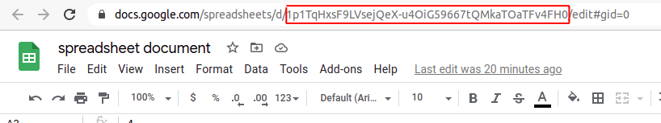

# Description

Reads the first tab of a Google spreadsheet document and returns it as an array of objects.

# Using

1. Init a new project:
   ```shell
   npm init -y
   ```

2. Install the package:
   ```shell
   npm i read-spreadsheet
   ```

3. Create `index.js` file with the following content: 
   ```javascript
   const readSpreadsheet = require('read-spreadsheet');
   
   (async () => {
     const jsonContent = await readSpreadsheet('<spreadsheetId>');
   
     // just to print it in readable format
     console.log(JSON.stringify(jsonContent, null, 2));
   })();
   ```
   where:
      - `<spreadsheetId>` you must get from this place and make the spreadsheet document as **public**:


   

4. Run it:
   ```shell
   node ./index
   ```
   ###### NOTICE
   If you want to use debugger mode you should set this environment variable and run the code:
   ```shell
   DEBUG=read-spreadsheet node ./index
   ```
   For this mode in case of normal work you mustn't see everything in the console. In the opposite case you will see an error description even if `throwable = false`. 

# FAQ

1. What if a spreadsheet document doesn't exist by ID?
   - You will get an empty array.


2. What if a spreadsheet document doesn't have public access?
   - You will get an empty array.


3. What if some cells are merged vertically or horizontally?
   - You will get the same content as if none of the cells were merged. Instead of content for merged cells you will get an empty string. 


4. What if a spreadsheet document contains images or diagrams?
   - All graphic elements will be ignored and every such cell will contain just an empty string. 

###### NOTICE
All cases are presented for non-throwable operations
